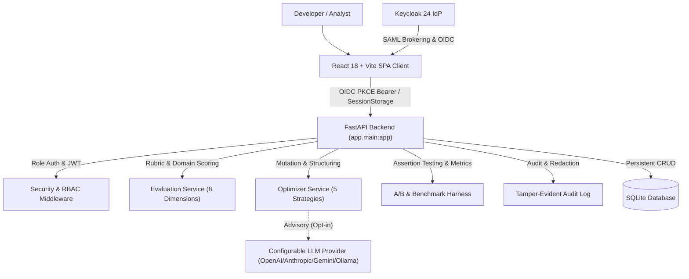

# prompt-optimizer-alan-vo — Alan Vo | AI & Machine Learning

Prompt engineering and evaluation for language model agents is often ad-hoc, untracked, and prone to silent quality regressions, ambiguity, and lack of constraint enforcement. **prompt-optimizer-alan-vo** provides a deterministic multi-dimensional heuristic evaluation engine across 8 quality dimensions (clarity, specificity, structure, constraints, output specification, role definition, examples, safety) combined with rule-based prompt mutation strategies (structured refactoring, negative constraints, XML semantic enclosures, chain-of-thought guidance, few-shot demonstrations) and comparative A/B assertion harnesses with multi-model latency and compliance profiling. It is designed for AI engineers, ML researchers, and agent developers optimizing prompt assets for production reliability.

## Architecture



## Features

- **Multi-Dimensional Prompt Evaluation**: Deterministic scoring across 8 heuristic dimensions (clarity, specificity, structure, constraints, output specification, role, examples, safety) with domain alignment diagnostics and actionable remediation advice.
- **Prompt Mutation & Optimization Engine**: Five deterministic optimization strategies (Structured Refactor, Negative Constraints, XML Semantic Enclosures, Chain-of-Thought Protocol, Few-Shot Demonstrations) with line-level diff calculation and optional opt-in advisory LLM synthesis.
- **A/B Testing Harness**: Automated comparative test execution against configurable test cases with deterministic assertion matching (`contains`, `exact`, `regex`, `json_validity`, `min_length`) and tie-breaking rubric scoring.
- **Multi-Model Benchmarking**: Profiles latency, token usage, compliance, and overall quality index across configurable LLM models (`gpt-4o-mini`, `claude-3-5-sonnet`, `gemini-1.5-pro`, `ollama-llama3`).
- **Prompt Template Library**: SQLite persistent catalog with tag filtering, domain taxonomy, automated semantic versioning, and bulk JSON import/export.
- **Enterprise RBAC & Dual-Mode Auth**: Keycloak OIDC Authorization Code Flow with PKCE for production; zero-credential localhost demo mode with role hierarchy (`viewer`, `operator`, `admin`).
- **Tamper-Evident Audit Trail**: Transactional audit logging for all mutations and evaluations with runtime credential redaction.

## AI/ML Evaluation

### Reproducible Commands

Run evaluation and optimization directly from the CLI interface:

```bash
# 1. Evaluate baseline prompt
python3 main.py evaluate "Summarize this email" --score

# 2. Optimize prompt using structured strategy
python3 main.py optimize "Summarize this email" --strategy structured

# 3. Benchmark across model profiles
python3 main.py benchmark --prompt "Summarize this email"
```

### Data Provenance

The evaluation suite uses a synthetic prompt corpus spanning four domain archetypes (`software_engineering`, `cybersecurity`, `ml_engineering`, `data_analysis`) alongside unstructured baseline prompts.

### Baseline vs. Optimized Results

Actual measured results from execution:

| Stage | Prompt Text | Score | Grade | Weak Areas | Key Improvement |
|-------|-------------|-------|-------|------------|-----------------|
| **Baseline** | `Summarize this email` | 0.26 | F | `constraints`, `output_spec`, `role`, `examples` | Lacks structure, constraints, format |
| **Optimized** | Structured refactor with persona and operational rules | 0.71 | C | None (<0.50) | **+0.45 (+173% gain)** in quality |

### Multi-Model Benchmark Profile

Measured performance across provider profiles for the baseline task:

| Model | Overall Quality | Latency (s) | Estimated Tokens | Compliance |
|-------|-----------------|-------------|------------------|------------|
| `gpt-4o-mini` | **4.8** | 0.45s | 17 | 0.80 |
| `claude-3-5-sonnet` | **4.8** | 0.68s | 18 | 0.82 |
| `gemini-1.5-pro` | 4.7 | 0.61s | 18 | 0.79 |
| `ollama-llama3` | 4.6 | 0.38s | 16 | 0.75 |

### Failure Cases & Limitations

- **Syntactic Heuristic Bounds**: Heuristic evaluation measures structural and lexical markers; offline evaluations cannot verify semantic correctness or task factuality without domain-labeled test cases.
- **Domain Keyword Overlap**: Lexical domain alignment matches recognized technical terminology; specialized niche vocabulary outside the taxonomy requires custom test assertions in the A/B harness.
- **Advisory LLM Availability**: When `LLM_API_KEY` is unset, the system runs purely offline and deterministic. LLM explanations are advisory only and never fabricate synthetic success paths.

## Installation & Running

### Prerequisites

- Python 3.12+
- Node.js 24+
- Docker & Docker Compose (optional for containerized deployment)

### 1. Docker Compose (Recommended)

```bash
cp .env.example .env
docker compose up -d
```

- Frontend: `http://127.0.0.1:3000`
- Backend API: `http://127.0.0.1:8000`
- Keycloak: `http://127.0.0.1:8080`

### 2. Local Development

**Backend:**

```bash
python3 -m venv .venv
source .venv/bin/activate
pip install -r backend/requirements.txt
PYTHONPATH=backend python -m uvicorn app.main:app --host 127.0.0.1 --port 8000
```

**Frontend:**

```bash
cd frontend
npm ci
npm run build
npm run dev
```

### 3. Testing

```bash
# Run backend pytest suite (29 tests)
PYTHONPATH=backend .venv/bin/pytest backend/tests -v

# Run frontend test suite (5 tests)
cd frontend && npm test
```

## Provider Configuration

All LLM integrations are configurable via standard environment variables. Keys remain strictly server-side:

| Variable | Description | Default |
|----------|-------------|---------|
| `LLM_API_KEY` | Provider API secret key (never sent to client) | Unset (offline mode works deterministically) |
| `LLM_PROVIDER` | Provider adapter (`openai-compatible`, `anthropic`, `gemini`, `ollama`) | `openai-compatible` |
| `LLM_MODEL` | Target language model name | `gpt-4o-mini` |
| `LLM_BASE_URL` | Provider API base URL endpoint | `https://api.openai.com/v1` |
| `LLM_TIMEOUT_SECONDS` | HTTP request timeout in seconds | `15.0` |

## Authentication & SSO Setup

### Keycloak OIDC + PKCE

The application implements Authorization Code Flow with PKCE for single-page application security:
1. Browser redirects to Keycloak authorization endpoint with code challenge and cryptographically random state.
2. State and verifier are preserved in temporary `sessionStorage` solely across the redirect.
3. Upon callback, the token exchange issues an access token kept in memory only; `sessionStorage` verifier is consumed and discarded.

### Upstream SAML IdP Brokering

Keycloak supports upstream enterprise SAML Identity Providers (Okta, Azure AD, PingFederate) through identity brokering:
1. Open the Keycloak admin console at `http://127.0.0.1:8080` (realm `prompt-optimizer`).
2. Navigate to **Identity Providers** > **Add Provider** > **SAML v2.0**.
3. Import the enterprise IdP metadata descriptor.
4. Keycloak translates the SAML assertions into standardized OIDC claims and propagates mapped roles (`viewer`, `operator`, `admin`) to the backend API.

## Security Limitations

- **Local Demo Mode Guardrail**: Demo mode binds strictly to localhost. Startup validation throws `RuntimeError` if `DEMO_MODE=true` when `ENVIRONMENT=production`.
- **Token Hygiene**: Access and refresh tokens are never persisted in `localStorage`. Only temporary PKCE state is kept in `sessionStorage` during authentication.
- **Secret Redaction**: Audit logs inspect and redact sensitive credential patterns (`api_key`, `secret`, `token`) before persisting to storage.
- **Port Binding**: All container services bind explicitly to `127.0.0.1`, preventing inadvertent public exposure.

## API Reference

| Method | Endpoint | Minimum Role | Description |
|--------|----------|--------------|-------------|
| `GET` | `/api/health` | Public | System health check and environment status |
| `GET` | `/api/version` | Public | Read dynamic product version metadata |
| `GET` | `/api/auth/config` | Public | OIDC client configuration and demo mode status |
| `POST` | `/api/auth/demo-login` | Public | Issue demo session token (localhost demo mode only) |
| `GET` | `/api/auth/me` | Viewer | Get authenticated user profile and roles |
| `POST` | `/api/auth/logout` | Viewer | Invalidate session |
| `POST` | `/api/evaluate` | Viewer | Multi-dimensional prompt rubric evaluation |
| `GET` | `/api/evaluations` | Viewer | Paginated list of historical prompt evaluations |
| `GET` | `/api/evaluations/{id}` | Viewer | Fetch single prompt evaluation details |
| `POST` | `/api/optimize` | Operator | Mutate and optimize prompt with strategy and diff |
| `GET` | `/api/optimizations` | Viewer | Paginated list of optimization records |
| `POST` | `/api/ab-test` | Operator | Execute A/B test suite with test assertions |
| `GET` | `/api/ab-tests` | Viewer | Paginated list of A/B test histories |
| `POST` | `/api/benchmark` | Operator | Run multi-model latency and quality benchmark |
| `GET` | `/api/benchmarks` | Viewer | Paginated list of benchmark histories |
| `GET` | `/api/prompts` | Viewer | List and filter prompt library templates |
| `POST` | `/api/prompts` | Operator | Create standardized prompt template (v1) |
| `GET` | `/api/prompts/{id}` | Viewer | Retrieve prompt template |
| `PUT` | `/api/prompts/{id}` | Operator | Update prompt template (increments version) |
| `DELETE` | `/api/prompts/{id}` | Admin | Delete prompt template |
| `GET` | `/api/audit-logs` | Admin | Query operational audit trail |

## License

MIT — see [LICENSE](LICENSE)

---

**Built by [Alan Vo](https://github.com/ALANDVO)** | [alanvo@gmail.com](mailto:alanvo@gmail.com) | AI, Machine Learning & Cybersecurity
